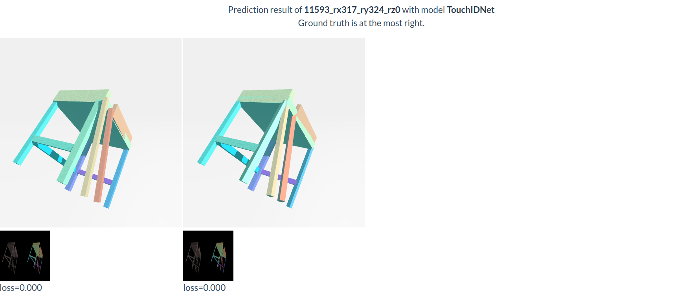
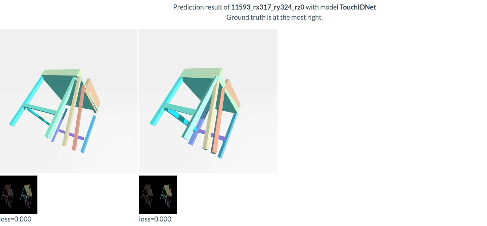

### Experiments
```bash
cd ./  # root directory of the cloned repository
conda activate CompNet
```

### Data
Download the following data and unzip it to ```data/```.

1. [Train](https://drive.google.com/drive/u/0/folders/1VqCC9p5GkrBZmknkBrzU7cXZjFpxRiOQ)
1. [Test with ground truth part masks](https://drive.google.com/drive/u/0/folders/1VqCC9p5GkrBZmknkBrzU7cXZjFpxRiOQ)
1. [Test with predicted part masks](https://drive.google.com/drive/u/0/folders/1VqCC9p5GkrBZmknkBrzU7cXZjFpxRiOQ)

### Pre-trained CompNet
Download the pretrained models and unzip to ```outputs/```.

The above link contains pretrained models including rotation module, axis length module, joint module.

### Testing CompNet
To reproduce the prediction results of the paper, run the following code

* Predict shapes with ground truth part masks 
```bash
bash ./scripts/predict_shape_with_gt_mask.sh chair
bash ./scripts/predict_shape_with_gt_mask.sh bed
bash ./scripts/predict_shape_with_gt_mask.sh table
bash ./scripts/predict_shape_with_gt_mask.sh cabinet
```
* Predict shapes with ground truth part masks 
```bash
bash ./scripts/predict_shape_with_predicted_mask.sh chair
bash ./scripts/predict_shape_with_predicted_mask.sh bed
bash ./scripts/predict_shape_with_predicted_mask.sh table
bash ./scripts/predict_shape_with_predicted_mask.sh cabinet
```

### Training SDFNet

#### Rotation module 
```python ./CompNet/train.py --cfg ./configs/RotNet.yaml```
#### Axis length module 
We provide two choices of axis length module: unary axis length module and group axis length module. 
* Train unary axis length module

```python ./CompNet/train.py --cfg ./configs/AxisLengthNet.yaml```
* Train group axis length module. Two seperate modules need to be trained. One classify whether two parts are translation symmetry and another module predict axis length given a group of parts. 
```bash
python ./CompNet/train.py --cfg ./configs/GroupAxisLengthNet.yaml 
python ./CompNet/train.py --cfg ./configs/SizeRelationNet.yaml 
```

In experiments, unary axis length module also generates satisfactory predictions.
#### Joint module 
```python ./CompNet/train.py --cfg ./configs/JointNet.yaml```


### Tools 
We provide visualization tools to help understand each module predictions. 

- After run the testing code ```bash ./scripts/predict_shape_with_gt_mask.sh bed```
- Go the prediction directory  ```cd ./outputs/prediction_gt_mask/bed```
- Run ```python -m http.server 8003``` and open link

The link provides prediction and visualization as follows.
```
    rot/                   # contains prediction results after rotation module
        table.html         # collections of predictions
        ...    
    size/                   # contains prediction results after rotation module and axis length module
        table.html
    center/                  # contains the final prediction results
    　　table_seq.html
```
Illustration of table.html. 


Example visualization of rotation module. Note the visualization below takes ground truth size and center.


Example visualization of size module. Note the visualization below takes ground truth center.


Example visualization of center module. Note we sequentially assemble the shape together. All rotation, size, and center are from predictions.


